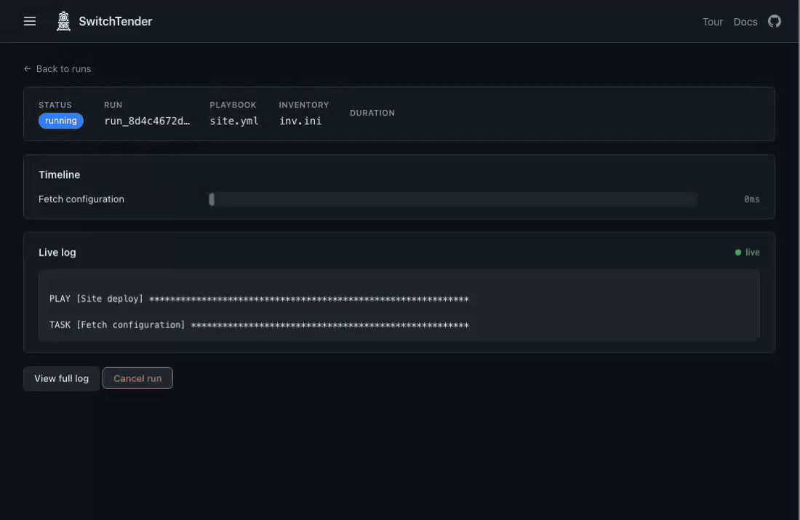
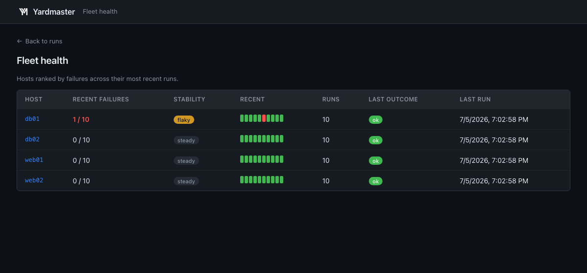

  <picture>
    <source media="(prefers-color-scheme: dark)" srcset="assets/logo-train-tracks-dark.png">
    
  </picture>

<h1 align="center">SwitchTender</h1>

  
  
  
  
  

Run everything. Watch every host. Prove every change. SwitchTender is the governed execution
boundary between your operators, human or AI agent, and the systems they change. One Go binary runs
Ansible, Terraform, OpenTofu, Bash, PowerShell, Python, and Go across your fleet, paints every run
live as a host-by-task matrix instead of a text scroll, and splits big jobs across parallel shards.
Every change walks one path through it, and comes out the other side as a signed receipt anyone can
verify offline.
No Kubernetes operator, no Postgres, no Redis, no message bus. One process, one SQLite file.

## Contents

- [Why](#why)
- [The path every change walks](#the-path-every-change-walks)
- [AI agents as principals](#ai-agents-as-principals)
- [See it](#see-it)
- [Requirements](#requirements)
- [Quick start](#quick-start)
- [Documentation](#documentation)
- [Design](#design)
- [The name](#the-name)
- [Roadmap](#roadmap)
- [Status](#status)
- [License](#license)

## Why

Automation controllers ask for a cluster before they run a playbook. A Kubernetes operator,
Postgres, Redis, and a mesh to reach your hosts, all standing before the first task does. Then a run
finishes and hands you a text log to scroll, and when it ends the tool forgets everything it saw.

SwitchTender runs those same playbooks from one binary and treats every run as structured data you
can read, split, and remember. One process, one file to back up, and a live host-by-task matrix
instead of scrollback.

|                                      | SwitchTender                                                                        | AWX                                             | Semaphore                |
|--------------------------------------|-----------------------------------------------------------------------------------|-------------------------------------------------|--------------------------|
| Deploy                               | One binary and one SQLite file, running in seconds.                               | A Kubernetes operator, Postgres, Redis, and Receptor first. | One binary.              |
| Every&nbsp;run                       | A live host-by-task matrix you read like a dashboard, with per-task drill-down.   | A host status bar over a streamed log, with per-event host drill-down. | A status and a streamed log. |
| Big&nbsp;jobs                        | Sharded across hosts, balanced by their measured duration, only failed shards retried. | Sliced round-robin, with no balancing.     | No splitting at all.     |
| Memory&nbsp;across&nbsp;runs         | Flaky hosts flagged, durations trended, every host's history kept.               | Forgotten the moment a run ends.                | Forgotten the moment a run ends. |
| Pipelines                            | A dependency graph with a drag-and-drop editor, passing typed outputs from one step to the next. | A visual workflow builder.       | Basic chaining.          |
| Leaving&nbsp;your&nbsp;old&nbsp;tool | One command imports your AWX or Semaphore projects, inventories, templates, surveys, and schedules. | Not applicable.                     | Not applicable.          |

The full head-to-head, including where SwitchTender is behind, is in the
[comparison](docs/comparison.md).

Checked against vendor documentation on 2026-07-31, for AWX 24.6.1 and Semaphore 2.18.29. These
products ship, and a table like this decays. If a row is out of date, open an issue and it gets
corrected.

SwitchTender sits above or alongside whatever already runs your changes. It does not ask you to rip
out Terraform, Jenkins, or GitHub Actions; it governs the changes that flow through it, and the
one-command AWX import is the on-ramp.

## The path every change walks

    request -> identity -> policy -> risk -> approval -> execution -> evidence -> verification

Eight stages, one gate, no side doors. Five of them are the ones a change-control review asks about:

**1. Request.** Every change enters through one submission path: the API, the UI, a template launch,
a schedule, a webhook, or an AI agent over MCP. The request is recorded on the tamper-evident hash
chain before anything acts on it, with who asked, how they authenticated, and a commitment to
exactly what was asked. A change that cannot be recorded is refused, not performed silently.

**2. Policy.** A separable, fail-closed engine decides before execution: proceed, hold for a
person's sign-off, or refuse outright. Policies match on the tool, the command, the target
inventory, the assessed risk of the operation, and who is asking, so an agent's request can face
rules a person's request does not. Policies live in the database or in a reviewed YAML file, and a
gate that cannot be evaluated refuses the run rather than waving it through. Terraform and OpenTofu
get a second, content-aware gate: the plan runs first, and an apply that would destroy more than the
policy allows is held with the plan attached.

**3. Approval.** A held run cannot be claimed by any executor until an approver releases it. The
decision is itself a chain entry: it names the approver and commits a digest of the exact spec being
released, so an approval binds to content, not to a run id whose meaning could drift. The executor
recomputes that digest before running and refuses a spec that changed after the decision.

**4. Execution.** Local workers, shared-database workers, or relay workers across a network
boundary, with container execution for every tool. The same policies gate execution wherever the
run is claimed, fail closed, and the outcome, exit code, per-host results, a digest of the full log,
and the spec digest, is committed to the chain by the process that observed it finish.

**5. Evidence.** `switchtender receipt <run-id>` seals the whole story, the request, the decision,
the execution, the outcome, into one signed file. `switchtender verify` checks it with no database,
no network, and no trust in the server that produced it: every chain link recomputes, the approver's
decision provably binds the digest of the spec that executed, and external RFC 3161 timestamps fix
the history in time. The same bytes verify under the open [loomseal](https://loomseal.com) verifier
and its independent Python reference implementation.

The remaining three stages are load-bearing but not headline: identity resolves who is asking and
caps what an agent may ever do, risk grades each operation from its command and blast radius so
policy can act on it, and independent verification is what turns the evidence from a claim the
operator makes into a statement a third party checks.

Precision about the offline claim, because it is the claim that matters: verification reads one
file and the key fingerprint you obtained out of band. Without the pinned fingerprint, verify
proves the receipt is internally intact but not who signed it. A range receipt discloses the run's
outcome, decisions, and redacted spec; a sparse receipt proves the same chain facts while
disclosing nothing about neighboring tenants' entries. A run that dies with the process that ran it
and never commits an outcome cannot be receipted, and the receipt command says so rather than
producing something weaker.

## AI agents as principals

An AI agent that changes infrastructure is a principal here, not an API key. Its token is minted as
an agent's, naming the human it acts for, and that classification is enforced and recorded, never
guessed from traffic:

    switchtender token new --agent --user owner --name prod-remediator

- **Bounded authority.** An agent token is capped below admin no matter what account it is bound
  to. It can launch and propose work; it can never manage identity, access, or secrets, and it can
  never approve a run, including its own. Separation of duties for machine changes holds by
  construction, not by convention.
- **Its own rules.** Policies can name what an agent may do, what it may never do, and what needs a
  person first:

      policies:
        - name: agents-never-drop-databases
          actor_kind: agent
          command_contains: "drop database"
          effect: deny
        - name: agent-destructive-needs-a-person
          actor_kind: agent
          min_risk: high
        - name: agent-terraform-needs-a-person
          actor_kind: agent
          tool: terraform

- **Attributed forever.** Every action lands in the chain as `actor_type: agent`, on behalf of the
  named human, committed by the entry hash, so a change an agent made cannot later be presented as
  a person's.
- **The same receipt.** The run an agent requested and a person approved produces the same signed,
  offline-verifiable receipt as any other change, showing the agent asked, the person approved
  exactly this spec, and this is what happened.

The MCP server (`switchtender mcp`) is how an agent talks to the gate: it can list templates,
propose runs, and read results, and it deliberately has no approve tool, no credential access, and
refuses to start on an admin token. The full walkthrough is in
[Run an AI agent through the gate](docs/agents.md).

## See it

Poke at the [live demo](https://demo.switchtender.com), read-only and seeded with real runs, nothing to install.

A two-shard split executing live: the merged host matrix fills in as hosts report, one shard
fails on the broken database host while the other lands clean, and the timeline draws itself:

Fleet health after a few runs: failure counts, flaky-host detection, and outcome sparklines per
host, remembered across every run:

## Requirements

- Ansible on the PATH: `ansible-playbook` and `ansible-inventory`.
- Go 1.26 to build from source, or Docker Compose and the Helm chart to deploy.
- Nothing else for the default SQLite setup. PostgreSQL is optional, for running more than one
  instance.

## Quick start

Try the [live demo](https://demo.switchtender.com) without installing anything, or run it yourself.

One line with a Go toolchain installed:

    go install github.com/kordloom/switchtender@latest

Or grab a build for your platform from the [releases page](https://github.com/kordloom/switchtender/releases):
a `SwitchTender.dmg` for macOS, a `windows_amd64.zip` for Windows, or a `tar.gz` of the binary for
macOS and Linux. Verify any download with `switchtender version --verify`, which checks the running
binary against the release's published hashes; see [verifying a release](SECURITY.md#verifying-a-release)
for that and for the cosign signature CI-built releases carry. Or build from source:

    go build -o switchtender .

Then serve:

    switchtender serve --addr :8080 --db switchtender.db

Or run it as a local desktop app. On macOS open `SwitchTender.app`; otherwise one command picks a
stable loopback port, keeps its data in a per-user directory, and opens the UI in your browser:

    ./switchtender desktop

Open http://localhost:8080 and submit a run:

    curl -X POST localhost:8080/v1/runs \
      -d '{"playbook": "site.yml", "inventory": "hosts.ini"}'

Add `"shards": 4` to split it across four slices of the inventory.

Migrating from AWX or Semaphore is one command. Point it at an export to see what it would create,
then apply:

    ./switchtender import awx awx-export.json           # dry-run report
    ./switchtender import awx awx-export.json --apply    # create the objects

Credentials come across as shells. Re-enter their secrets, since exports omit them by design. The
[switching-from-AWX guide](docs/switching-from-awx.md) walks the whole move.

Coming from [AWX](https://switchtender.com/awx-alternative),
[Ansible Automation Platform](https://switchtender.com/aap-alternative),
[Semaphore](https://switchtender.com/semaphore-alternative), or
[Ascender](https://switchtender.com/ascender-alternative). Rundeck has no importer yet, so that move
is by hand today.

To see it without any setup, run the seeded read-only demo. It fills a fresh database with sample
projects, templates, and real runs, then serves it with every change blocked:

    ./switchtender demo --addr :8080         # or: docker compose --profile demo up --build

## Documentation

The docs live in [docs/](docs/) and also render inside the app at `/ui/docs`.

| Guide | What |
|-------|------|
| [Quickstart](docs/quickstart.md) | Zero to a first run in a few minutes |
| [Switching from AWX](docs/switching-from-awx.md) | Import what you have, or set up from scratch |
| [Concepts](docs/concepts.md) | Runs, splits, pipelines, projects, templates, and the rest |
| [Configuration](docs/configuration.md) | Every command, flag, and environment variable |
| [Desktop](docs/desktop.md) | Run SwitchTender as a local desktop app |
| [Features](docs/features.md) | The full capability list |
| [AI agents](docs/agents.md) | Put an AI agent behind the approval gate and prove what it did |
| [Extend in Go](docs/sdk.md) | The SDK: add tools, AI providers, secret engines, and notifiers |
| [HTTP API](docs/api.md) | Every endpoint the server exposes |
| [Migration](docs/migration.md) | Moving off AWX or Semaphore in detail |
| [Comparison](docs/comparison.md) | How SwitchTender compares to AWX and Semaphore |

Deploy with the `docker-compose.yml` at the root, which brings up a server, a database, and a
worker, or the Helm chart under [deploy/helm](deploy/helm).

## Design

A single-binary monolith on purpose. The serve command hosts the HTTP API, an in-process executor
with a bounded worker pool, the cron scheduler, and the embedded UI.

- Storage is SQLite through a pure Go driver in WAL mode. No cgo, one file to back up, and the
  store sits behind an interface a Postgres backend can satisfy for multi-instance deployments.
- Structured events come from an embedded Ansible callback plugin that writes one JSON object per
  event to a sidecar file. The dispatcher tails the sidecar as the run executes, storing and
  publishing events without touching the human-readable log.
- Every run executes under its own cancel context. Canceling a split parent stops all of its
  shards. Canceling a pipeline stops the current step and halts the sequence.

## The name

A switchtender keeps the line: watching every train, holding the lantern, making sure each one runs on
time, on the right track, and clear of the next. Good name for the job this tool does, since it
watches every host, proves every change, and stands guard over the whole fleet. A few internal
packages still carry rail-yard codenames, the roundhouse runs the playbooks and the dispatcher
coordinates them, but the API, the UI, and everything you operate speak plain Ansible. No glossary
required.

## Roadmap

- A hosted option.
- Signed desktop packages for macOS and Windows.
- An OpenStack credential kind.
- Group-driven roles for OIDC sign-in, which LDAP, SAML, and JWT already have.

## Status

Version 1.x. Source-available under the Business Source License 1.1. The execution engine, the
control plane, and the one-command AWX and Semaphore migration are complete. The HTTP API is served
under a stable `/v1` base path and follows semantic versioning, so no breaking change lands within
the 1.x line.

## License

Business Source License 1.1. Read the source, run it, and use it in production. The self-hosted
binary ships every enterprise feature at no cost: single sign-on, role-based access control, the
tamper-evident audit chain, approval gates, and active-active HA. The one reserved right is offering
SwitchTender to others as a hosted or managed service that competes with the maintainer. Each version
converts to Apache-2.0 four years after its release.

See `LICENSE` for the exact terms and [`LICENSING.md`](LICENSING.md) for what self-hosting grants,
how a commercial license works, and how to ask about support or a hosted plan.

  

