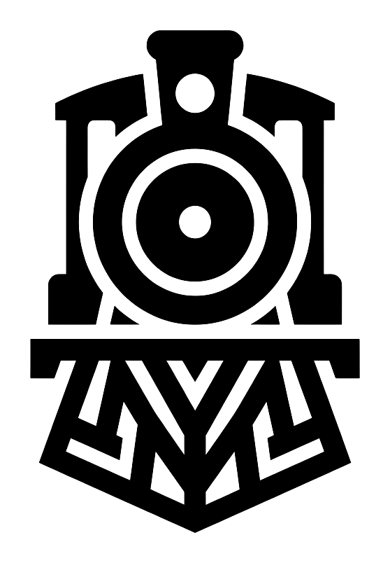

  <picture>
    <source media="(prefers-color-scheme: dark)" srcset="../assets/logo-train-dark.png">
    
  </picture>

# Tutorials

Short, task-focused walk-throughs for the everyday work of running a fleet. Each one takes a few
steps. New to SwitchTender? Start with the [quickstart](quickstart.md), then come back. The fastest
orientation is inside the app itself: Tour in the top bar launches guided tours of the product,
the pitch, and the migration path.

| Task | What it does |
|------|--------------|
| [Run a job](tutorial-run-a-job.md) | Launch a run, with any tool.|
| [Save a template](tutorial-save-a-template.md) | Save a launch preset.|
| [Schedule a job](tutorial-schedule-a-job.md) | Fire a template on a cron.|
| [Set a secret](tutorial-set-a-secret.md) | Seal a secret, or resolve it from Vault at run time.|
| [Migrate your setup](tutorial-migrate.md) | Import a whole export at once.|

Going beyond Ansible? The per-tool guides cover what each engine does and how values reach it:
[Bash](tool-bash.md), [Terraform](tool-terraform.md), [Python](tool-python.md), and [Go](tool-go.md).

For the bigger picture, read [switching from AWX](switching-from-awx.md) and the
[concepts](concepts.md) page.
